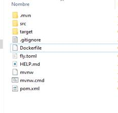
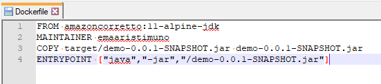
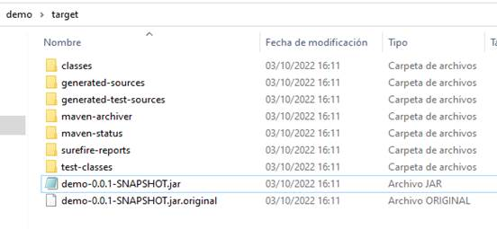
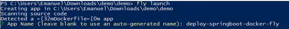
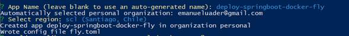
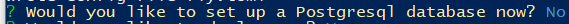
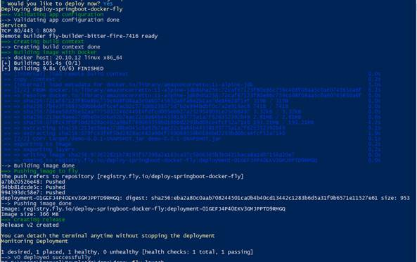
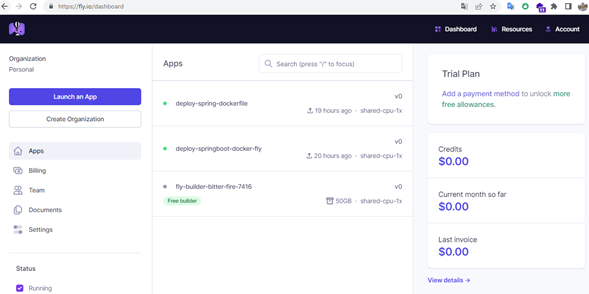
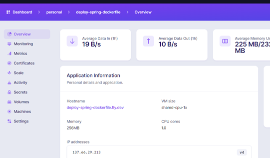
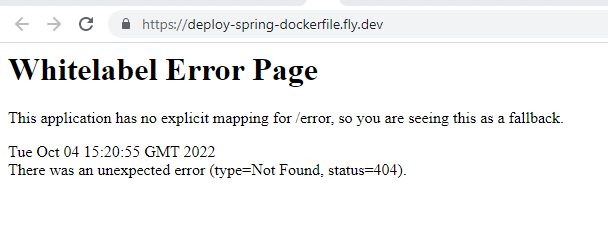

# Desplegar aplicación Springboot en Fly.io usando Dockerfile

Autor: Licenciado en Sistemas Informáticos Emanuel Aristimuño **https://www.linkedin.com/in/emanuel-aristimu%C3%B1o/** 

La siguiente guía sirve únicamente para generar el despliegue de una aplicación Springboot en la nube de fly.io de forma totalmente gratuita.

Para poder **dockerizar** localmente una app es necesario seguir la siguiente guía: [ **https://spring.io/guides/gs/spring-boot-docker/** ](https://spring.io/guides/gs/spring-boot-docker/)

Pre requisito: tener compilación de proyecto springboot en su computadora local.

A continuación, se detallan los pasos a seguir:

*1. Crear archivo **Dockerfile** , en la carpeta de tu proyecto springboot:*

*2. Al archivo creado agregarle la dependencia necesaria para levantar jdk11 (por el momento solo jdk11-alpine) y la referencia del archivo **.jar** que contiene la compilación de nuestro proyecto springboot:*

Código base:

	`FROM amazoncorretto:11-alpine-jdk
 
	MAINTAINER emaaristimuno
 
	COPY**  **target/NAME-YOUR-FILE-BUILD-SPRINGBOOT.jar** **NAME-YOUR-FILE-BUILD-SPRINGBOOT.jar
 
	ENTRYPOINT ["java","-jar","/NAME-YOUR-FILE-BUILD-SPRINGBOOT.jar"]`

Ejemplo:

Para el ejemplo la compilación que se tendrá en cuenta para crear la imagen se encuentra dentro de la carpeta  *target*:

**target/demo-0.0.1-SNAPSHOT.jar**

*3. Instalar utilidad de comandos para trabajar con Fly:  [flyctl][https://fly.io/docs/hands-on/install-flyctl/]. Ejecutando en Powershell de Windows:*

`**iwr** **https://fly.io/install.ps1** **-useb** **|** **iex**`

*4. Si esta es tu primera vez con Fly.io, tu próximo paso será [Registrarte](https://fly.io/docs/hands-on/sign-up/) .*
 Elegir  **Try Fly.io for Free**  como plan para comenzar.

*5. Iniciar sesión en Fly:*

 `**fly auth signup**`

*6. Desplegar nuestra aplicación en los servidores de fly. *

6.1 Ejecutando los siguientes comandos dentro del directorio donde se encuentra el dockerfile:*

 `**fly launch**`
 
 

Referencia: https://fly.io/docs/languages-and-frameworks/dockerfile/

6.2 Definir un nombre para nuestra aplicación desplegada en Fly:
  
  

6.3 Seleccionar la región que levantara nuestra app

Lo cual creara un archivo  **fly.toml**  con las configuraciones necesarias.

6.4 Nos pregunta si queremos instalar una Base de Datos Postgresql, seleccionar que  **No** :

6.5 Finalmente, generar nuestro Deploy respondiendo  **YES**  a la pregunta:

*7. Abrir aplicaciones desplegadas en [https://fly.io/dashboard](https://fly.io/dashboard)*

*8. Seleccionar la app, Ejemplo:  **deploy-spring-dockerfile** *

9. Verificar el correcto funcionamiento del servidor:

**AUTOR: LIC. En sistemas informáticos Emanuel Aristimuño **
| --- | --- |